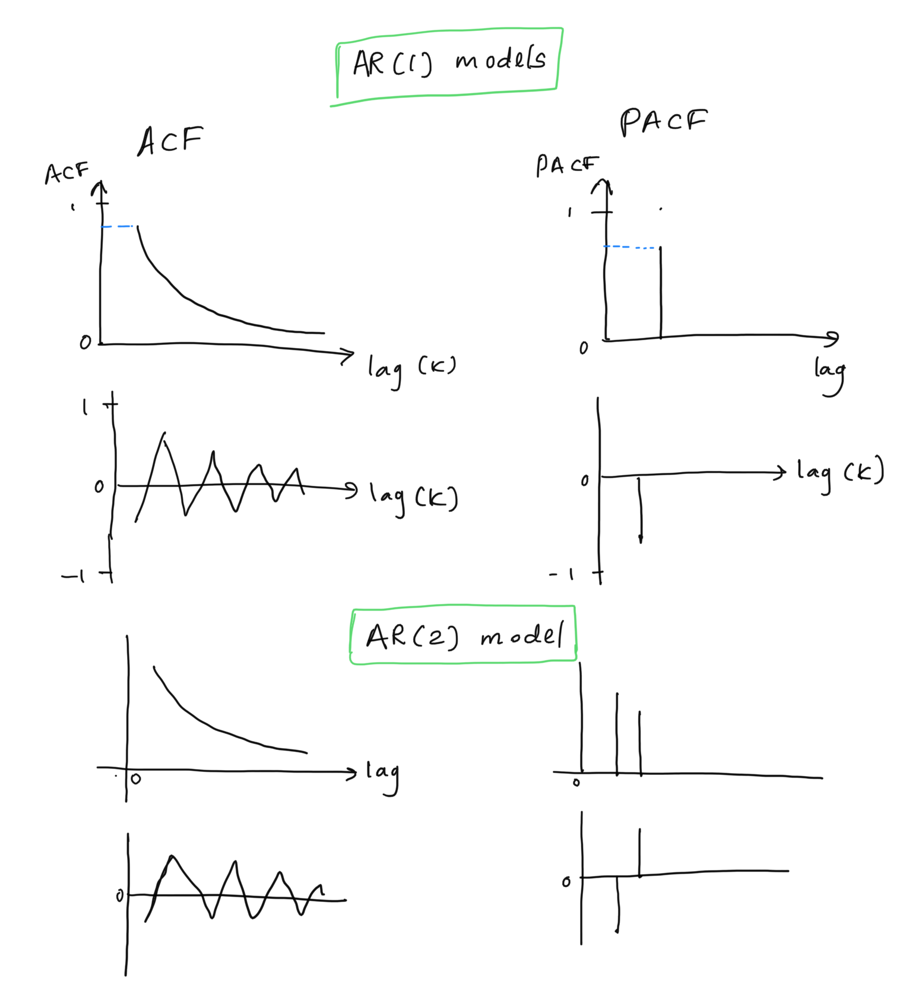
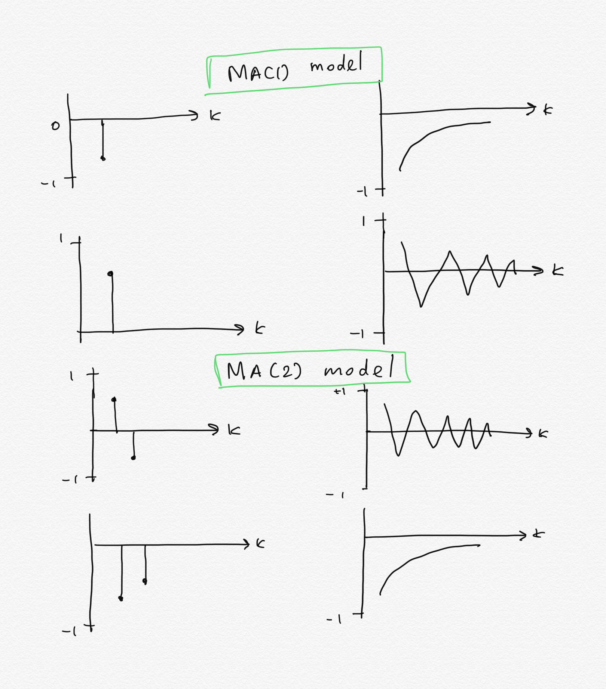
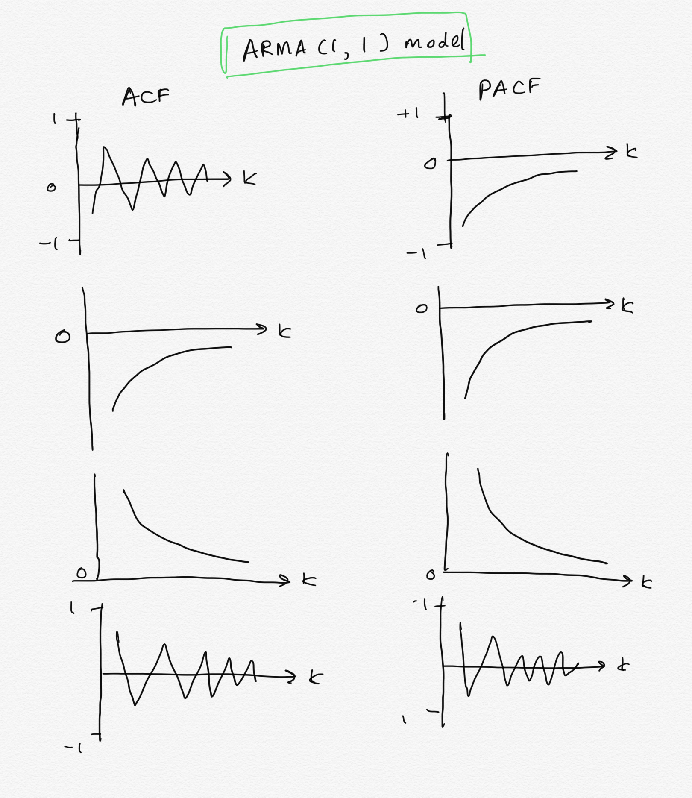

```{r setup, include=FALSE}
knitr::opts_chunk$set(echo = FALSE, cache=TRUE, messages=FALSE, warning=FALSE)
# Make sure you have the latest version of rmarkdown and bookdown
#devtools::install_github("rstudio/rmarkdown")
#devtools::install_github("rstudio/bookdown")
library(ggplot2)
```


\newpage

# Introduction

## Models for stationary time series

- $AR$ models

- $MA$ models

- $ARMA$ models

## Models for nonstationary time series

- $ARIMA$ models

- $SARIMA$ models

First, we will look at the theoretical properties of these models. 

# Autoregressive process

## Properties of AR(1) model

Consider the following $AR(1)$ model. 

\begin{equation}
  \label{eq:ar}
Y_t=\phi_0+\phi_1Y_{t-1}+\epsilon_{t}
\end{equation}

where ${\epsilon_t}$ is assumed to be a white noise process with mean zero and variance $\sigma^2$. 


### Mean

Assuming that the series is weak stationary, we have $E(Y_t)=\mu$, $Var(Y_t)=\gamma_0$, and $Cov(Y_t, Y_{t-k})=\gamma_k$, where $\mu$ and $\gamma_0$ are constants. Given that ${\epsilon_t}$ is a white noise, we have $E(\epsilon_t)=0$. The mean of $AR(1)$ process can be computed as follows:

$$
\begin{aligned}
  E(Y_t) &= E(\phi_0+\phi_1 Y_{t-1}) \\
         &= E(\phi_0) +E(\phi_1 Y_{t-1}) \\
         &= \phi_0 +\phi_1 E(Y_{t-1}). \\
\end{aligned}
$$


Under the stationarity condition, $E(Y_t)=E(Y_{t-1})=\mu$. Thus we get

$$\mu = \phi_0+\phi_1\mu.$$

Solving for $\mu$  yields

\begin{equation}
  \label{eq:2}
E(Y_t)=\mu=\frac{\phi_0}{1-\phi_1}.
\end{equation}


The results has two constraints for $Y_t$. First, the mean of $Y_t$ exists if $\phi \neq 1 .$ The mean of $Y_t$ is zero if and only if $\phi_0=0$.  

### Variance and the stationary condition of AR (1) process

First take variance of both sides of Equation \@ref(eq:ar)

$$Var(Y_t)=Var(\phi_0+\phi_1 Y_{t-1}+\epsilon_t)$$

The $Y_{t-1}$ occurred before time $t$. The $\epsilon_t$ does not depend on any past observation. Hence, $cov(Y_{t-1}, \epsilon_t)= 0$. Furthermore, ${\epsilon_t}$ is a white noise and hence

$$Var(Y_t)=\phi_1^2 Var(Y_{t-1})+\sigma^2.$$

Under the stationarity condition, $Var(Y_t)=Var(Y_{t-1})$, so that,

$$Var(Y_t)=\frac{\sigma^2}{1-\phi_1^2}.$$

provided that $\phi_1^2 < 1$ or $|\phi| < 1$ (The variance of a random variable is bounded and non-negative). The necessary and sufficient condition for the $AR(1)$ model in Equation \@ref(eq:ar) to be weakly stationary is $|\phi| < 1$. This condition is equivalent to saying that the root of $1-\phi_1B = 0$ must lie outside the unit circle. This can be explained as below

Using the backshift notation we can write $AR(1)$ process as 

$$Y_t = \phi_0 + \phi_1BY_{t} + \epsilon_t.$$

Then we get

$$(1-\phi_1B)Y_t=\phi_0 + \epsilon_t.$$ The $AR(1)$ process is said to be stationary if the roots of $(1-\phi_1B)=0$ lie outside the unit circle. 

### Covariance 

The covariance $\gamma_k=Cov(Y_t, Y_{t-k})$ is called the lag-$k$ autocovariance of $Y_t$. The two main properties of $\gamma_k$: (a) $\gamma_0=Var(Y_t)$ and (b) $\gamma_{-k}=\gamma_{k}$. 

The lag-$k$ autocovariance of $Y_t$ is

\begin{equation}
  \label{eq:3}
\begin{aligned}
  \gamma_k &= Cov(Y_t, Y_{t-k}) \\
         &= E[(Y_t-\mu)(Y_{t-k}-\mu)] \\
         &= E[Y_tY_{t-k}-Y_t\mu-\mu Y_{t-k} +\mu^2] \\
         &= E(Y_t Y_{t-k}) - \mu^2. \\
\end{aligned}
\end{equation}

Now we have 

\begin{equation}
  \label{eq:3}
  E(Y_t Y_{t-k}) = \gamma_k + \mu^2
\end{equation}

### Autocorrelation function of an AR(1) process

To derive autocorrelation function of an AR(1) process we first multiply both sides of Equation \@ref(eq:ar) by $Y_{t-k}$ and take expected values:

$$E(Y_tY_{t-k})=\phi_0E(Y_{t-k})+\phi_1 E(Y_{t-1}Y_{t-k})+E(\epsilon_tY_{t-k})$$
Since $\epsilon_t$ and $Y_{t-k}$ are independent and using the results in Equation \@ref(eq:3)

$$\gamma_k + \mu^2 = \phi_0 \mu+\phi_1(\gamma_{k-1}+\mu^2)$$

Substituting the results in Equation \@ref(eq:2) to Equation \@ref(eq:3) we get

\begin{equation}
\label{eq:5}
\gamma_k = \phi_1 \gamma_{k-1}.
\end{equation}


The autocorrelation function, $\rho_k$, is defined as 

$$\rho_k = \frac{\gamma_k}{\gamma_0}$$.

Setting $k=1$, we get $\gamma_1 = \phi_1\gamma_0.$ Hence,

$$\rho_1=\phi_1.$$

Similarly with $k=2$, $\gamma_2 = \phi_1 \gamma_1$. Dividing both sides by $\gamma_0$ and substituting with $\rho_1=\phi_1$ we get 

$$\rho_2=\phi_1^2.$$

Now it is easy to see that in general 

\begin{equation}
\label{eq:acfar1}
\rho_k = \frac{\gamma_k}{\gamma_0}=\phi_1^k 
\end{equation}

for $k=0, 1, 2, 3, ...$.

Since $|\phi_1| < 1,$ the autocorrelation function is an exponentially decreasing as the number of lags $k$ increases. There are two features in the ACF of AR(1) process depending on the sign of $\phi_1$. They are,

1. If $0 < \phi_1 < 1,$ all correlations are positive.

1. if $-1 < \phi_1 < 0,$ the lag 1 autocorrelation is negative ($\phi_1=\phi_1$) and the signs of successive autocorrelations alternate from positive to negative with their magnitudes decreasing exponentially. 


## Properties of AR(2) model

Now consider an second-order autoregressive process (AR(2)) 

\begin{equation}
  \label{eq:ar2}
Y_t=\phi_0+\phi_1Y_{t-1}+\phi_2Y_{t-2}+\epsilon_t.
\end{equation}

### Mean


**Question 1:** Using the same technique as that of the AR(1), show that 

$$E(Y_t) = \mu = \frac{\phi_0}{1-\phi_1 - \phi_2}$$ and the mean of $Y_t$ exists if $\phi_1 + \phi_2 \neq 1$.

### Variance

**Question 2:** Show that $$Var(Y_t) = \frac{(1-\phi_2)\sigma^2}{(1+\phi_2)((1+\phi_2)^2-\phi_1^2)}.$$

Here is a guide to the solution

Start with

$$Var(Y_t)=Var(\phi_0+\phi_1Y_{t-1}+\phi_2Y_{t-2}+\epsilon_t)$$

Solve it until you obtain the Eq. (a) as shown below.

\begin{equation}
\tag{a}
\gamma_0 (1-\theta_1^2 - \theta_1^2) = 2\theta_1\theta_2\gamma_1+\sigma^2.
\end{equation}

Next multiply both sides of Equation \@ref(eq:ar2) by $Y_{t-1}$ and obtain a expression for $\gamma_1$. Let's call this Eq. (b).

Solve Eq. (a) and (b) for $\gamma_0.$

### Stationarity of AR(2) process

To discuss the stationarity condition of the $AR(2)$ process we use the roots of the characteristic polynomial. Here is the illustration. 

Using the backshift notation we can write $AR(2)$ process as 

$$Y_t = \phi_0 + \phi_1 BY_{t} + \phi_2 B^2 Y_{t} + \epsilon_t.$$

Furthermore, we get

$$(1-\phi_1 B - \phi_2 B^2) Y_t = \phi_0 + \epsilon_t.$$

The **characteristic polynomial** of $AR(2)$ process is 

$$\Phi(B)=1-\phi_1 B - \phi_2 B^2.$$

and the corresponding **AR characteristic equation**

$$1-\phi_1 B - \phi_2 B^2=0.$$


For stationarity, the roots of AR characteristic equation must lie outside the unit circle. The two roots of the AR characteristic equation are 

$$\frac{\phi_1 \pm \sqrt{\phi_1^2 + 4\phi_2}}{-2\phi_2}$$

Using algebraic manipulation, we can show that these roots will exceed 1 in modulus if and only if simultaneously $\phi_1 + \phi_2 < 1,$ $\phi_2-\phi_1 < 1,$ and $|\phi_2| < 1.$ This is called the stationarity condition of $AR(2)$ process.


### Autocorrelation function of an AR(2) process

To derive autocorrelation function of an AR(2) process we first multiply both sides of  Equation \@ref(eq:ar2) by $Y_{t-k}$ and take expected values:


\begin{align}
E(Y_tY_{t-k}) &= E(\phi_0Y_{t-k}+\theta_1Y_{t-1}Y_{t-k}+\theta_2Y_{t-2}Y_{t-k})+\epsilon_tY_{t-k} \\
&= \phi_0 E(Y_{t-k})+\phi_{1}E(Y_{t-1}Y_{t-k}) + \phi_2 E(Y_{t-2} Y_{t-k}) + E(\epsilon_tY_{t-k}).
\end{align}


Using the independence between $\epsilon_t$ and $Y_{t-1}$, $E(\epsilon_t Y_{t-k})=0$ and the results in Equation \@ref(eq:3) (This is valid for AR(2)) we have

$$\gamma_k + \mu^2 = \gamma_0 \mu + \theta_1 (\gamma_{k-1}+\mu^2)+\phi_2 (\gamma_{k-2}+\mu^2).$$

(Note that $E(X_{t-1}X_{t-k})=E(X_{t-1}X_{(t-1)-(k-1)}=\gamma_{k-1})$)

Solving for $\gamma_k$ we get

\begin{align}
\label{eq:eq9}
 \gamma_k=\phi_1\gamma_{k-1}+\phi_2\gamma_{k-2}.
\end{align}

By dividing the both sides of Equation \@ref(eq:eq9) by $\gamma_0$, we have

\begin{align}
\label{eq:yule2}
 \rho_k=\phi_1\rho_{k-1}+\phi_2\rho_{k-2}.
\end{align}

for $k>0$. 

Setting $k=1$ and using $\rho_0=1$ and $\rho_{-1}=\rho_1$, we get **the Yule-Walker equation for $AR(2)$ process.**

$$\rho_1=\phi_1+\phi_2 \rho_1$$ or

$$\rho_1 = \frac{\phi_1}{1-\phi_2}$$.

Similarly, we can show that 

$$\rho_2 = \frac{\phi_2(1-\phi_2)+\phi_1^2}{(1-\phi_2)}.$$


## Properties of AR(p) model

The $p$th order autoregressive model can be written as

\begin{align}
Y_t = \phi_0 + \phi_1Y_{t-1}+\phi_2 Y_{t-2}+ ... + \phi_p Y_{t-p}+\epsilon_t.
\end{align}

The AR characteristic equation is 

$$1-\phi_1B-\phi_2B^2-...-\phi_pB^p=0.$$

For stationarity of $AR(p)$ process, the $p$ roots of the AR characteristic must lie outside the unit circle. 

### Mean

**Question 3: ** Find $E(Y_t)$ of $AR(p)$ process.
 
### Variance

**Question 4: ** Find $Var(Y_t)$ of $AR(p)$ process.


### Autocorrelation function (ACF) of an AR(p) process

**Question 5: ** Similar to the results in Equation \@ref(eq:yule2) for $AR(2)$ process, obtain the following recursive relationship for $AR(p)$. 

\begin{align}
\label{eq:yulep}
\rho_k = \phi_1\rho_{k-1}+\phi_2 \rho_{k-2} + ... + \phi_p \rho_{k-p}.
\end{align}


Setting $k=1, 2, ..., p$ into Equation \@ref(eq:yulep) and using $\rho_0=1$ and $\rho_{-k}=\rho_k$, we get the Yule-Walker equations for $AR(p)$ process


\begin{equation}
  \label{eq:13}
\begin{aligned}
  \rho_1 &= \phi_1+\phi_2 \rho_{1} + ... + \phi_p \rho_{p-1}\\
  \rho_2 &= \phi_1 \rho_1+\phi_2  + ... + \phi_p \rho_{p-2}\\
  ... \\
  \rho_p &= \phi_1 \rho_{p-1} +\phi_2 \rho_{p-2}  + ... + \phi_p \\
\end{aligned}
\end{equation}

The Yule-Walker equations in \@ref(eq:13) can be written in matrix form as below.

$$\left[\begin{array}
{r}
\rho_1  \\
\rho_2  \\
.\\
.\\
.\\
\rho_p
\end{array}\right] = \left[\begin{array}
{rrrrrrr}
1 & \rho_1 & \rho_2 & .&.&.& \rho_{p-1} \\
\rho_1 & 1 & \rho_1 & .&.&.& \rho_{p-2} \\
. & . & . & .&.&.& . \\
. & . & . & .&.&.& . \\
. & . & . & .&.&.& . \\
\rho_{p-1} & \rho_{p-2} & \rho_{p-3} & .&.&.& 1 \\
\end{array}\right] \left[\begin{array}
{r}
\phi_1  \\
\phi_2  \\
.\\
.\\
.\\
\phi_p
\end{array}\right]
$$

or 

$$\bm{\rho_p}=\bm{P_p\phi}.$$

 where,
 
$$\bm{\rho_p} = \left[\begin{array}
{r}
\rho_1  \\
\rho_2  \\
.\\
.\\
.\\
\rho_p
\end{array}\right], \bm{P_p} = \left[\begin{array}
{rrrrrrr}
1 & \rho_1 & \rho_2 & .&.&.& \rho_{p-1} \\
\rho_1 & 1 & \rho_1 & .&.&.& \rho_{p-2} \\
. & . & . & .&.&.& . \\
. & . & . & .&.&.& . \\
. & . & . & .&.&.& . \\
\rho_{p-1} & \rho_{p-2} & \rho_{p-3} & .&.&.& 1 \\
\end{array}\right], \bm{\phi} = \left[\begin{array}
{r}
\phi_1  \\
\phi_2  \\
.\\
.\\
.\\
\phi_p
\end{array}\right]$$

The parameters can be estimated using 

$$\bm{\phi}=\bm{P_p^{-1}\rho_p}.$$

**Question 6:** Obtain the parameters of an $AR(3)$ process whose first autocorrelations are $\rho_1=0.9$; $\rho_2=0.9$; $\rho_3=0.5$. Is the process stationary?

## The partial autocorrelation function (PACF)

Let $\phi_{ki}$, the $j$th coefficient in an $AR(k)$ model. Then, $\phi_{kk}$ is the last coefficient. From Equation \@ref(eq:yulep), the $\phi_{kj}$ satisfy the set of equations

\begin{equation}
\label{eq:pacf}
\rho_j=\phi_{k1}\rho_{j-1}+...+\phi_{k(k-1)}\rho_{j-k+1}+\phi_{kk}\rho_{j-k},
\end{equation}

for $j=1, 2, ...k$, leading to the Yule-Walker equations which may be written

\begin{equation}
\label{eq:pacf}
\left[\begin{array}
{r}
\rho_1  \\
\rho_2  \\
.\\
.\\
.\\
\rho_k
\end{array}\right] = \left[\begin{array}
{rrrrrrr}
1 & \rho_1 & \rho_2 & .&.&.& \rho_{k-1} \\
\rho_1 & 1 & \rho_1 & .&.&.& \rho_{k-2} \\
. & . & . & .&.&.& . \\
. & . & . & .&.&.& . \\
. & . & . & .&.&.& . \\
\rho_{k-1} & \rho_{k-2} & \rho_{k-3} & .&.&.& 1 \\
\end{array}\right] \left[\begin{array}
{r}
\phi_{k1}  \\
\phi_{k2}  \\
.\\
.\\
.\\
\phi_{kk}
\end{array}\right]
\end{equation}

or 


$$\bm{\rho_k}=\bm{P_k\phi_k}.$$

where

$$\bm{\rho_k} = \left[\begin{array}
{r}
\rho_1  \\
\rho_2  \\
.\\
.\\
.\\
\rho_k
\end{array}\right], \bm{P_k} =\left[\begin{array}
{rrrrrrr}
1 & \rho_1 & \rho_2 & .&.&.& \rho_{k-1} \\
\rho_1 & 1 & \rho_1 & .&.&.& \rho_{k-2} \\
. & . & . & .&.&.& . \\
. & . & . & .&.&.& . \\
. & . & . & .&.&.& . \\
\rho_{k-1} & \rho_{k-2} & \rho_{k-3} & .&.&.& 1 \\
\end{array}\right], \bm{\phi_k} = \left[\begin{array}
{r}
\phi_{k1}  \\
\phi_{k2}  \\
.\\
.\\
.\\
\phi_{kk}
\end{array}\right]$$


For each $k$, we compute the coefficients $\phi_{kk}$. Solving the equations for $k=1, 2, 3...$ successively, we obtain

For $k=1$,

\begin{equation}
\label{eq:p1}
\phi_{11}=\rho_1.
\end{equation}

For $k=2$,

\begin{equation}
\label{eq:p2}
\phi_{22}=\frac{\left[\begin{array}
{rr}
1 & \rho_2  \\
\rho_1 & \rho_2  \\
\end{array}\right]}{\left[\begin{array}
{rr}
1 & \rho_1  \\
\rho_1 & 1  \\
\end{array}\right]} = \frac{\rho_2-\rho_1^2}{1-\rho_1^2}
\end{equation}

For $k=3$,

\begin{equation}
\label{eq:p3}
\phi_{33}=\frac{\left[\begin{array}
{rrr}
1 & \rho_1 & \rho_1  \\
\rho_1 & 1 & \rho_2  \\
\rho_2 & \rho_1 & \rho_3  \\
\end{array}\right]}{\left[\begin{array}
{rrr}
1 & \rho_1 & \rho_2  \\
\rho_1 & 1 & \rho_1  \\
\rho_2 & \rho_1 & 1  \\
\end{array}\right]}
\end{equation}

The quantity $\phi_{kk}$ is called the partial autocorrelation at lag $k$ and can be defined as 
$$\phi_{kk}=Corr(Y_tY_{t-k}|Y_{t-1}, Y_{t-2},..., Y_{t-k+1}).$$
The partial autocorrelation between $Y_t$ and $Y_{t-k}$ is the correlation between $Y_t$ and $Y_{t-k}$ after removing the effect of the intermediate variables $Y_{t-1}, Y_{t-2}, ..., Y_{t-k+1}$.


In general the determinant in the numerator of Equations \@ref(eq:p1), \@ref(eq:p2) and \@ref(eq:p3) has the same elements as that in the denominator, but replacing the last column with $\bm{\rho_k}= (\rho_1, \rho_2,...\rho_k).$

### PACF for AR(1) models

From Equation \@ref(eq:acfar1) we have 

$\rho_k=\phi_1^k$ for $k=0, 1, 2, 3,...$

Hence, for $k=1$, the first partial autocorrelation coefficient is

$$\phi_{11}=\rho_1=\phi_1.$$
From \@ref(eq:p2)  for $k=2$, the second partial autocorrelation coefficient is

$$\phi_{22}=\frac{\rho_2-\rho_1^2}{1-\rho_1^2}=\frac{\phi_1^2-\phi_1^2}{1-\phi_1^2} = 0$$.

Similarly, for $AR(1)$ we can show that $\phi_{kk}=0$ for all $k > 0$. Hence, for $AR(1)$ process the partial autocorrelation is non-zero for lag $1$ which is the order of the process, but is zero for lags beyond the order 1. 

### PACF for AR(2) model

**Question 7:** For $AR(2)$ process show that $\phi_{kk}=0$ for all $k>2$. Sketch the PACF of $AR(2)$ process.

### PACF for AR(P) model

In general for $AR(p)$ precess, the partial autocorrelation function $\phi_{kk}$ is non-zero for $k$ less than or equal to $p$ (the order of the process) and zero for all $k$ greater than $p$. In other words, the partial autocorrelation function of a $AR(p)$ process has a cut-off after lag $p$. 


# Moving average (MA) models


We first derive the properties of $MA(1)$ and $MA(2)$ models and then give the results for the general $MA(q)$ model. 

## Properties of MA(1) model

The general form for $MA(1)$ model is

\begin{equation}
  \label{eq:ma1}
Y_t = \theta_0 + \theta_1 \epsilon_{t-1} + \epsilon_t
\end{equation}

where $\theta_0$ is a constant and ${\epsilon_t}$ is a white noise series.

### Mean

**Question 8:** Show that $E(Y_t) = \theta_0$. 

### Variance

**Question 9:** Show that $Var(Y_t) = (1+\theta_1^2)\sigma^2$.

We can see both mean and variance are time-invariant.  $MA$ models are finite linear combinations of a white noise sequence. Hence, $MA$ processes are always weakly stationary. 

### Autocorrelation function of an MA(1) process

#### Method 1

To obtain the autocorrelation function of $MA(1)$, we first multiply both sides of Equation \@ref(eq:ma1) by $Y_{t-k}$ and take the expectation. 

\begin{equation}
\label{eq: ma1acfs1}
\begin{aligned}
E[Y_tY_{t-k}] &= E[\theta_0 Y_{t-k} + \theta_1 \epsilon_{t-1} Y_{t-k} + \epsilon_t Y_{t-k}]\\
&= \theta_0 E(Y_{t-k}) + \theta_1 E(\epsilon_{t-1}Y_{t-k}) + E(\epsilon_t Y_{t-k})\\
\end{aligned}
\end{equation}

Using the independence between $\epsilon_t$ and $Y_{t-k}$ (future error and past observation) $E(\epsilon_t Y_{t-k}) = 0$. Now we have

\begin{equation}
\label{eq:ma1acfs2}
E[Y_tY_{t-k}] = \theta_0^2  + \theta_1 E(\epsilon_{t-1}Y_{t-k}) 
\end{equation}

Now let's obtain an expression for $E[Y_t Y_{t-k}]$. 


\begin{equation}
  \label{eq:covma1}
\begin{aligned}
  \gamma_k &= Cov(Y_t, Y_{t-k}) \\
         &= E[(Y_t-\theta_0)(Y_{t-k}-\theta_0)] \\
         &= E[Y_tY_{t-k}-Y_t\theta_0-\theta_0 Y_{t-k} +\theta_0^2] \\
         &= E(Y_t Y_{t-k}) - \theta_0^2. \\
\end{aligned}
\end{equation}

Now we have 

\begin{equation}
  \label{eq:covma1}
  E(Y_t Y_{t-k}) = \gamma_k + \theta_0^2
\end{equation}

Using the Equations \@ref(eq:ma1acfs2) and \@ref(eq:covma1) we have

\begin{equation}
  \label{eq:covma2}
  \gamma_k = \theta_0^2 - \theta_0^2 + \theta_1E(\epsilon_{t-1}Y_{t-k})
\end{equation}

Now let's consider the case $k=1$.

\begin{equation}
  \label{eq:covma3}
  \gamma_1 = \theta_0^2 - \theta_0^2 + \theta_1E(\epsilon_{t-1}Y_{t-1})
\end{equation}


Today's error and today's value are dependent. Hence, $E(\epsilon_{t-1}Y_{t-1}) \neq 0.$ We first need to identify $E(\epsilon_{t-1}Y_{t-1})$.

\begin{equation}
  \label{eq:covma4}
\begin{aligned}
E(\epsilon_{t-1}Y_{t-1}) &= E(\theta_0 \epsilon_{t-1} + \theta_1 \epsilon_{t-2} \epsilon_{t-1}+ \epsilon_{t-1}^2)\\
\end{aligned}
\end{equation}

Since, {$\epsilon_t$} is a white noise process $E(\epsilon_{t-1}) = 0$ and $E(\epsilon_{t-2} \epsilon_{t-1}) = 0$. Hence, we have

\begin{equation}
  \label{eq:covma5}
\begin{aligned}
E(\epsilon_{t-1}Y_{t-1}) &= E(\epsilon_{t-1}^2)=\sigma^2\\
\end{aligned}
\end{equation}

Substituting \@ref(eq:covma5) in \@ref(eq:covma3) we get

$$\gamma_1=\theta_1\sigma^2$$.

Furthermore, $\gamma_0 = Var(Y_t)=  (1+\theta_1^2)\sigma^2$. Hence

$$\rho_1=\frac{\gamma_1}{\gamma_0}=\frac{\theta}{1+\theta_1^2}.$$

When $k=2$, from Equation \@ref(eq:covma3)  and $E(\epsilon_{t-1}Y_{k-2}) = 0$ (future error and past observation) we get $\gamma_2=0$. Hence $\rho_2=0$. Similarly, we can show that

$$\gamma_k = \rho_k=0$$ for all $k \geq 2$.

We can see that the ACF of $MA(1)$ process is zero, beyond the order of 1 of the process.

#### Method 2: By using the definition of covariance


\begin{equation}
  \label{eq:mtd21}
\begin{aligned}
\gamma_1 = Cov(Y_t, Y_{t-1}) &= Cov(\epsilon_t + \theta_1 \epsilon_{t-1}+ \theta_0, \epsilon_{t-1}+\theta_1 \epsilon_{t-2} + \theta_0)\\
&=Cov(\theta_1 \epsilon_{t-1}, \epsilon_{t-1})\\
&=\theta_1 \sigma^2.
\end{aligned}
\end{equation}


\begin{equation}
  \label{eq:mtd21}
\begin{aligned}
\gamma_2=Cov(Y_t, Y_{t-2}) &= Cov(\epsilon_t + \theta_1 \epsilon_{t-1}+ \theta_0, \epsilon_{t-2}+\theta_1 \epsilon_{t-3} + \theta_0)\\
&=0.
\end{aligned}
\end{equation}

We have $\gamma_0=\sigma^2(1+\theta_1^2)$, (Using the variance).

Hence

$$\rho_1=\frac{\gamma_1}{\gamma_0}=\frac{\theta_1}{1+\theta_1^2}.$$

Similarly we can show $\gamma_k=\rho_k=0$ for all $k \geq 2$.

## Properties of MA(2) model

An $MA(2)$ model is in the form

\begin{equation}
  \label{eq:ma2}
Y_t = \theta_0 + \theta_1 \epsilon_{t-1} + \theta_2 \epsilon_{t-2} + \epsilon_t
\end{equation}

where $\theta_0$ is a constant and ${\epsilon_t}$ is a white noise series.

### Mean

**Question 10: ** Show that $E(Y_t) = \theta_0.$

### Variance

**Question 11: ** Show that $Var(Y_t) = \sigma^2 (1+\theta_1^2 + \theta_2^2).$

### Autocorrelation function of an MA(2) process

**Question 12: **For $MA(2)$ process show that,

$$\rho_1=\frac{\theta_1(1+\theta_2)}{1+\theta_1^2+\theta_2^2},$$
$$\rho_2 = \frac{\theta_2}{1+\theta_1^2 + \theta_2^2},$$

and $\rho_k=0$ for all $k \geq 3.$

## Properties of MA(q) model

\begin{equation}
  \label{eq:ma2}
Y_t = \theta_0 + \theta_1 \epsilon_{t-1} + \theta_2 \epsilon_{t-2} +...+ \theta_q \epsilon_{t-q} +\epsilon_t
\end{equation}

where $\theta_0$ is a constant and ${\epsilon_t}$ is a white noise series.

### Mean

**Question 13:** Show that the constant term of an $MA$ model is the mean of the series (i.e. $E(Y_t)=\theta_0$).

### Variance

**Question 14:** Show that the variance of an $MA$ model is 
$$Var(Y_t)=(1+\theta_1^2+\theta_2^2+...+\theta_q^2)\sigma^2.$$

### Autocorrelation function of an MA(q) process

**Question 15:** Show that the autocorrelation function of a $MA(q)$ process is zero, beyond the order of $q$ of the process. In other words, the autocorrelation function of a moving average process has a cutoff after lag $q$.

## Partial autocorrelation function of an MA(q) process

The partial autocorrelation functions for $MA(q)$ models behave very much like the autocorrelation functions of $AR(p)$ models. The PACF of $MA$ models decays exponentially to zero, rather like ACF for $AR$ model.

# Dual relation between AR and MA process

**Dual relation 1**

**First we consider the relation AR(p) <--> MA(**$\infty$**)**

Let $AR(p)$ be a **stationary** $AR$ model with order $p$. Then,

$$Y_t = \phi_1Y_{t-1}+ \phi_2Y_{t-2}+...+ \phi_pY_{t-p}+\epsilon_t,$$
where $\epsilon_t \sim WN(0, \sigma^2).$

Using the backshift operator we can write the $AR(p)$ model as

$$(1-\phi_1B-\phi_2B^2-...-\phi_pB^P)Y_t=\epsilon_t.$$
Then 

$$\phi(B)Y_t=\epsilon_t,$$
where $\phi(B)=1-\phi_1B-\phi_2B^2-...-\phi_pB^p.$ Furthermore, $Y_t$ can be written as infinite sum of previous $\epsilon$'s as below

$$Y_t = \phi^{-1}(B)\epsilon_t,$$
where $\psi(B)=1+\Psi_1B+\psi_2B^2+...,$ such that $\phi(B)\psi(B)=1.$ Then $Y_t=\psi(B)\epsilon_t$ is a $MA(\infty)$ process.

**Next, we consider the relation MA(q) <--> AR(**$\infty$**)**

Let $MA(q)$ be **invertible** moving average process 

$$Y_t = \epsilon_t + \theta_t\epsilon_{t-1}+\theta_2\epsilon_{t-2}+...+\theta_p\epsilon_{t-q}.$$

Using the backshift operator we can write the $MA(q)$ process as 

$$Y_t = (1+\theta_1B+\theta_2B^2-...+\theta_qB^q)\epsilon_t.$$

Then, 
 
 $$Y_t = \theta(B)\epsilon_t,$$
 
 where $\theta(B)=1+\theta_1B+\theta_2B^2+...+\theta_1B^q.$ Hence, for an **invertible** moving average process, $Y_t$ can be represented as a finite weighted sum of previous error terms, $\epsilon$. Furthermore, since the process is invertible $\epsilon_t$ can be represented as an infinite weighted sum of previous $Y$'s as below
 
 $$\epsilon_t=\theta^{-1}(B)Y_t,$$
where $\pi(B)\theta(B)=1$, and $\pi(B) = 1+\pi_1B+\pi B^2+...$. Hence,

$$\epsilon_t = \pi(B)Y_t.$$ This is an representation of a $AR(\infty)$ process.

**Dual relation 2**

An $MA(q)$ process has an ACF function that is zero beyond lag $q$ and its PACF is decays exponentially to 0. Consequently, an $AR(p)$ process has an PACF that is zero beyond lag-$p$, but its ACF decays exponentially to 0.

**Dual relation 3**

For an $AR(p)$ process the roots of $\phi(B)=0$ must lie outside the unit circle to satisfy the condition of stationarity. However, the parameters of the $AR(p)$ are not required to satisfy any conditions to ensure invertibility. Conversely, the parameters of the $MA$ process are not required to satisfy any condition to ensure stationarity. However, to ensure the condition of invertibility, the roots of $\theta(B)=0$ must lie outside the unit circle.

# Autoregressive and Moving-average (ARMA) models


current value = linear combination of past values + linear combination of past error + current error

The $ARMA(p, q)$ can be written as

$$Y_t=c+\phi_1 Y_{t-1}+\phi_2 Y_{t-2}+...+\phi_p Y_{t-p}+\theta_1\epsilon_{t-1}+\theta_2\epsilon_{t-2}+...+\theta_q\epsilon_{t-q}+\epsilon_t,$$
where $\{\epsilon_t\}$ is a white noise process.

Using the back shift operator

$$\phi(B)Y_t=\theta(B)\epsilon_t,$$
where $\phi(.)$ and $\theta(.)$ are the $p$th and $q$th degree polynomials,

$$\phi(B)=1-\phi_1 \epsilon -...-\phi_p \epsilon^p,$$
and
$$\theta(B)=1+\theta_1\epsilon+...+\theta_q\epsilon^q.$$

## Stationary condition

Roots of $$\phi(B)=0$$ lie outside the unit circle.

## Invertible condition

Roots of $$\theta(B)=0$$ lie outside the unit circle.


## Autocorrelation function and  Partial autocorrelation function

The ACF of an ARMA model exhibits a pattern similar to that of an AR model. The PACF of ARMA process behaves like the PACF of a MA process. Hence, the ACF and PACF are not informative in determining the order of an ARMA model.

# Theoretical ACF and PACF for AR, MA and ARMA models

Theoretical autocorrelation coefficients for some of the more common AR, MA and ARMA models are shown here. However, the ACF and PACF calculated from the data will not exactly match any set of theoretical ACF and PACF because the ACF and PACF calculated from the data are subject to sampling variation.

\newpage

## AR models



\newpage

## MA models



\newpage

## ARMA models



\newpage
